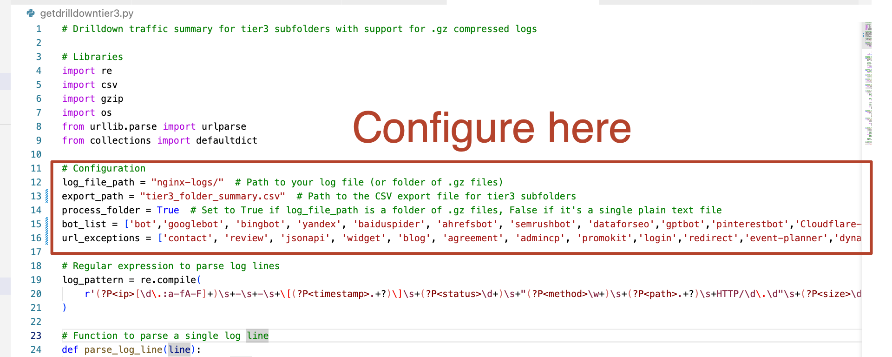

# About

This is a small collection of utilities used by Orbit Media's [Website Optimization](https://www.orbitmedia.com/website-optimization/) team. Contains independent scripts for varied SEO/CRO use cases. Use them however you like.

## Getting Started

If you're a marketer or exec whose primary function isn't programming, don't be intimidated.

Quick install for Mac:

1. Open Terminal 
2. Install [Homebrew](https://brew.sh): ``/bin/bash -c "$(curl -fsSL https://raw.githubusercontent.com/Homebrew/install/HEAD/install.sh)"``
3. Install Python:
``brew install python``
4. Install Pip:
``python -m ensurepip --upgrade``

Wasn't that easy? Now run a script.

5. Run a script:
``python getdata.py``

Paste any errors into ChatGPT. Most of scripts rely on libraries of outside code and you probably just need that extra tool (such as Pandas). That's why you installed Pip. 

6. Install Pandas:
``pip install pandas``

Now you have Pandas, Pip, and Python, and can try again.

## Troubleshooting

Configure most scripts near the top of the file.

Logfiles from nginx, Apache httpd, and other [common web servers are standardized](https://en.wikipedia.org/wiki/Common_Log_Format), but you may need to customize the regex somewhat near the top of each file for some. Use testparse.py for testing that.

# Scripts

## Utilities

🐍 [testparse.py](https://github.com/Orbit-Media-Studios/wo-scripts/blob/main/testparse.py): Parse just the first 3 lines of a server log to confirm the regex format is correct

🐍 [getcsv.py](https://github.com/Orbit-Media-Studios/wo-scripts/blob/main/getcsv.py): Converts a flat server log into CSV

## Analysis 

### Logfiles 

🐍 [getexitpages.py](https://github.com/Orbit-Media-Studios/wo-scripts/blob/main/getexitpages.py): Discover and list all exit pages from a particular URL

🐍 [getpagectr.py](https://github.com/Orbit-Media-Studios/wo-scripts/blob/main/getpagectr.py): Summarize a folder of .gz-archived logs for counts and "CTRs" of page exit URLs

🐍 [getsitesearch.py](https://github.com/Orbit-Media-Studios/wo-scripts/blob/main/getsitesearch.py): Summarize site search data from a single access log in a CSV

🐍 [getsitesearchmulti.py](https://github.com/Orbit-Media-Studios/wo-scripts/blob/main/getsitesearchmulti.py): Summarize site search data from a folder full of .gz-archived logs

🐍 [getdrilldowntier1.py](https://github.com/Orbit-Media-Studios/wo-scripts/blob/main/getdrilldowntier1.py): Summarize # of subpages and and aggregate hits (old UA drilldown report)

🐍 [getdrilldowntier2.py](https://github.com/Orbit-Media-Studios/wo-scripts/blob/main/getdrilldowntier2.py): Same as "tier1" script, but summarizes all tier 2 subfolders

🐍 [getdrilldowntier3.py](https://github.com/Orbit-Media-Studios/wo-scripts/blob/main/getdrilldowntier3.py): Same as "tier1" script, but summarizes all tier 3 subfolders 

### International SEO

🐍 [getmixedlang.py](https://github.com/Orbit-Media-Studios/wo-scripts/blob/main/getmixedlang.py): Detect and isolate mixed language content using [lingua](https://github.com/pemistahl/lingua-py)

